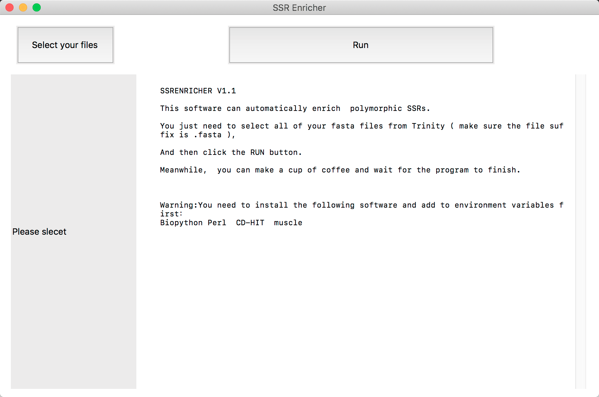

# SSREnricher V1.1

This software can automatically enrich  polymorphic SSRs with transcripts.

## What does SSREnricher do
This software can automatically enrich  polymorphic SSRs.

You just need to select all of your fasta files from Trinity and run this software.

We have two versions for different users, one running on Linux or macOS with a graphical interface, and another one running in the shell.

## Dependencies
You need to install the following software and add to environment variables first：
Biopython Perl  CD-HIT  muscle
